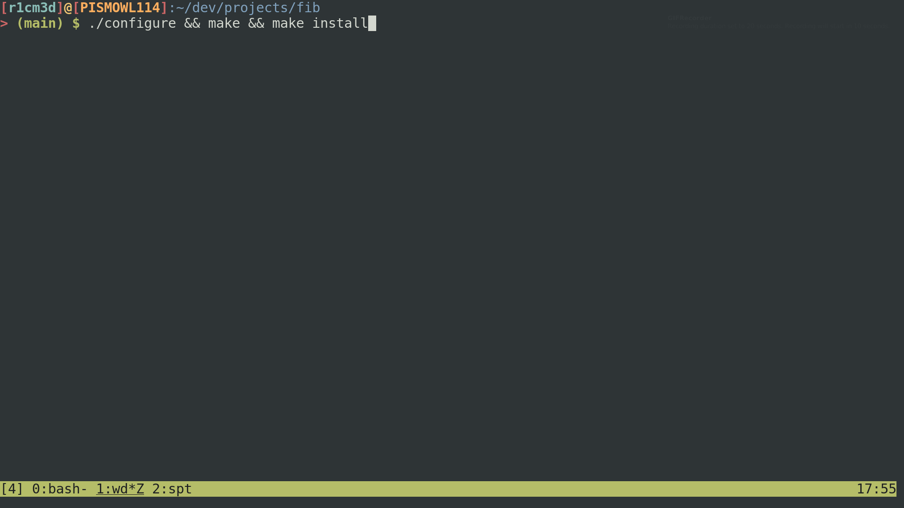
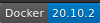
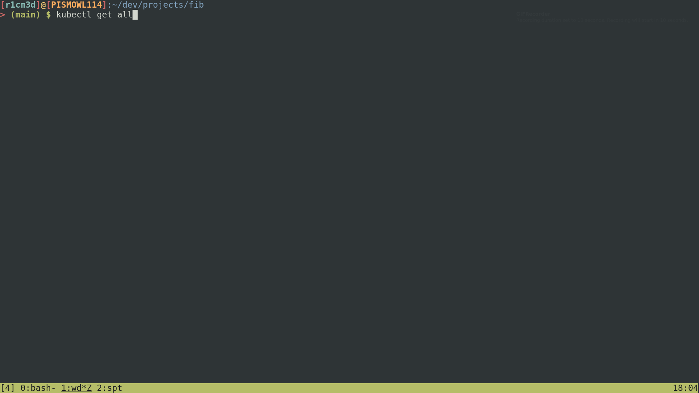

# fib
This containerized reactive RESTful API implements an efficient Θ(log.n) fibonacci algorithm using Quarkus framework

## Table of Contents
* [TL;DR](#tldr)
* [Prerequisites](#prerequisites)
    * [To run](#to-run-in-docker-container)
    * [To develop](#to-run-locally)
* [Test](#test)
    * [Unit Test](#unit-test)
    * [Large n argument](#large-n-argument)
* [Deploy](#deploy)

### TLDR
``` shell
./configure
```
Configure will check if all prerequisites are installed. It uses `command` application.
See: **Important Disclaimer** at the top of the [configure](scripts/configure.sh) file for troubleshooting.
``` shell
make && make install
```
To assemble Docker container and create executable file (just an alias for `docker run` command).
``` shell
./fib
```
The output should be:
``` shell
exec java -Dquarkus.http.host=0.0.0.0 -Djava.util.logging.manager=org.jboss.logmanager.LogManager -XX:+ExitOnOutOfMemoryError -cp . -jar /deployments/quarkus-run.jar
__  ____  __  _____   ___  __ ____  ______
 --/ __ \/ / / / _ | / _ \/ //_/ / / / __/
 -/ /_/ / /_/ / __ |/ , _/ ,< / /_/ /\ \
--\___\_\____/_/ |_/_/|_/_/|_|\____/___/
2021-07-29 18:40:32,968 INFO  [io.quarkus] (main) fib 0.0.1-SNAPSHOT on JVM (powered by Quarkus 2.0.3.Final) started in 0.996s. Listening on: http://0.0.0.0:8080
2021-07-29 18:40:32,970 INFO  [io.quarkus] (main) Profile prod activated.
2021-07-29 18:40:32,970 INFO  [io.quarkus] (main) Installed features: [cdi, resteasy-reactive, smallrye-context-propagation, vertx]
```
Running on [Bash](https://www.gnu.org/software/bash/)


### Prerequisites




#### To run in Docker container
You only need [Make](https://www.gnu.org/software/make/) (tested with GNU Make 4.2.1, but it should work on others)
and [Docker](https://www.docker.com/) (tested with Docker version 20.10.2, build 2291f61)  installed. It is important to give execution permission for `scripts/`:
``` shell
chmod +x scripts/
```
They are safe, but you could check it out if you don't believe me. :smile:
#### To run locally
``` shell
make run-local
```
It will build locally and run using `java` executable. (Must have a JVM installed)

### Test
#### Unit test
``` shell
make test
```
#### Large n argument
``` shell
[r1cm3d]@[PISMOWL114]:~/dev/projects/fib
> (main) $ time curl http://localhost:8080/fib?n=70000000
a lot of numbers...
real    3m18,691s
user    0m0,018s
sys     0m0,167s
```
### Deploy
``` shell
make start-k8s && make deploy-k8s
```
It will start `minikube` and deploy `fib` application and `fib_hpa` which is an autoscaler based on CPU 
and memory utilization. Autoscaler is need to be compliance with scale requirement based on workload.

